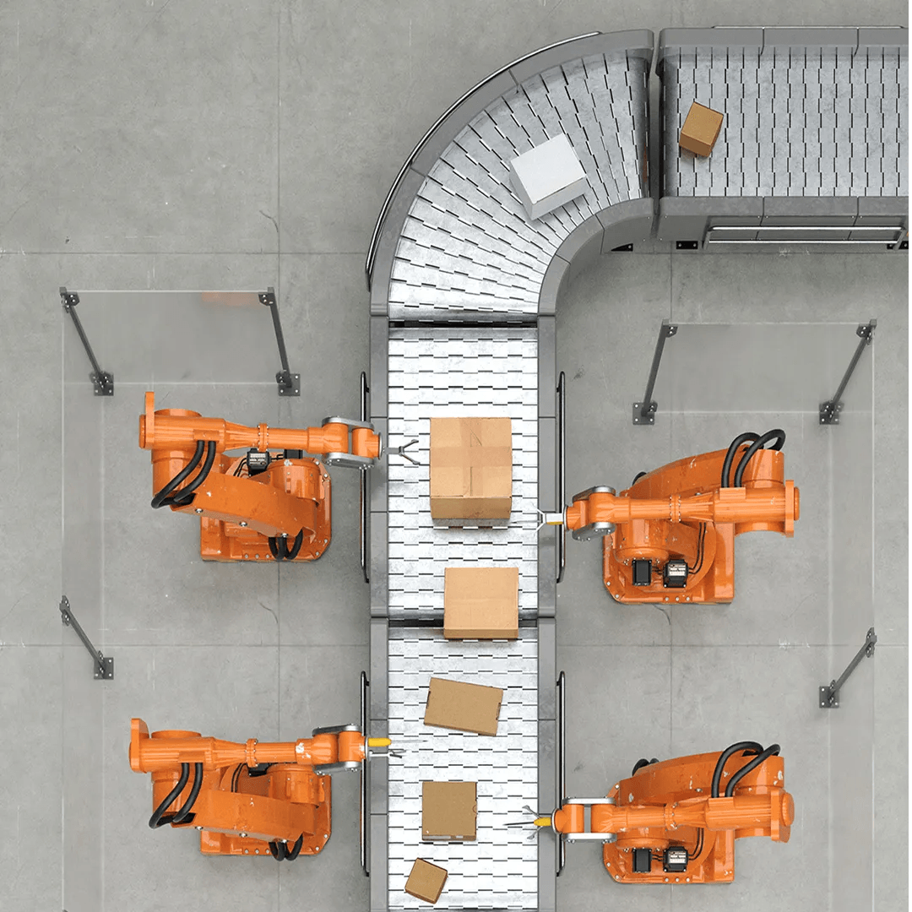
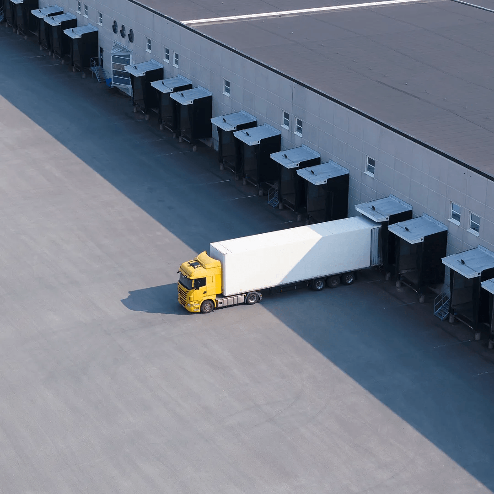

+-----------------------------------------------------------------------+
| **Hero**                                                              |
+-----------------------------------------------------------------------+
|  |
+-----------------------------------------------------------------------+
| # Boost your business with an interconnected supply chain             |
|                                                                       |
| [Get in touch](https://pages-businessmessaging.bt.com/BT_Supply_chain.html) |
+-----------------------------------------------------------------------+

---

+---------------------------------------------------+----------------------------------------------+
| **Columns**                                       |                                              |
+---------------------------------------------------+----------------------------------------------+
| # The power of an interconnected supply chain     | Supply chains have always been about connection. People, places, systems and products all working in sync to keep businesses running, customers happy and teams moving forward. |
|                                                   |                                              |
|                                                   | But right now, those connections are under pressure. Disruption is more frequent. Costs are rising. Talent is harder to find and hold onto. And many organisations are still relying on legacy tools and siloed systems that can't keep up with what today demands. |
|                                                   |                                              |
|                                                   | That's why so many supply chain leaders are stepping back and rethinking their strategy. They want better visibility. Simpler communication. Stronger resilience. And the confidence that every part of the chain – from planning and procurement to customer returns – is working as one. |
|                                                   |                                              |
|                                                   | This guide is here to show how BT can help you build a supply chain that's more connected, more transparent and better equipped to handle change. One that supports your teams, serves your customers and grows with your business. |
|                                                   |                                              |
|                                                   | However complex things get, BT's got your back. |
+---------------------------------------------------+----------------------------------------------+

---

## Contents

+-----------------------------------------------------------------------+----------------------------------------------+
| **Cards**                                                             |                                              |
+-----------------------------------------------------------------------+----------------------------------------------+
|  | **Why an interconnected supply chain matters** |
|                                                                       |                                              |
|                                                                       | Understand the challenges today's supply chain leaders are facing – and how BT can help you take a more connected, resilient approach. |
|                                                                       |                                              |
|                                                                       | [Read more](./why-an-interconnected-supply-chain-matters) |
+-----------------------------------------------------------------------+----------------------------------------------+
|  | **What happens if your supply chain stays the same?** |
|                                                                       |                                              |
|                                                                       | Explore the hidden risks of a disconnected supply chain. |
|                                                                       |                                              |
|                                                                       | [Read more](./what-happens-if-nothing-changes) |
+-----------------------------------------------------------------------+----------------------------------------------+
|  | **What does an interconnected supply chain look like?** |
|                                                                       |                                              |
|                                                                       | Explore how BT supports every stage of the supply chain. |
|                                                                       |                                              |
|                                                                       | [Read more](./what-an-integrated-supply-chain-looks-like) |
+-----------------------------------------------------------------------+----------------------------------------------+
|  | **Your supply chain questions, answered** |
|                                                                       |                                              |
|                                                                       | Find answers to common questions about BT's solutions and how they integrate across your business. |
|                                                                       |                                              |
|                                                                       | [Read more](./faqs) |
+-----------------------------------------------------------------------+----------------------------------------------+
|  | **Why BT?** |
|                                                                       |                                              |
|                                                                       | Discover why BT are the right partner for your supply chain transformation. |
|                                                                       |                                              |
|                                                                       | [Read more](./why-bt) |
+-----------------------------------------------------------------------+----------------------------------------------+
|  | **Get in touch** |
|                                                                       |                                              |
|                                                                       | Ready to explore your options? Find the right contact details and helpful links to start your supply chain conversation with BT. |
|                                                                       |                                              |
|                                                                       | [Read more](./get-in-touch) |
+-----------------------------------------------------------------------+----------------------------------------------+

+--------------------+--------+
| **Section Metadata** |      |
+--------------------+--------+
| style              | purple |
+--------------------+--------+

---

+--------------------+---------------------------------------------------+
| **Metadata**       |                                                   |
+--------------------+---------------------------------------------------+
| title              | Welcome - Integrated Supply Chain                 |
+--------------------+---------------------------------------------------+
| description        | Find out how an integrated supply chain can benefit your organisation, speak to us today. |
+--------------------+---------------------------------------------------+
| og:image           | https://assets.foleon.com/eu-central-1/de-screenshots-1d5fh4/323951/948o91tplnpi9rql_fb.png |
+--------------------+---------------------------------------------------+
